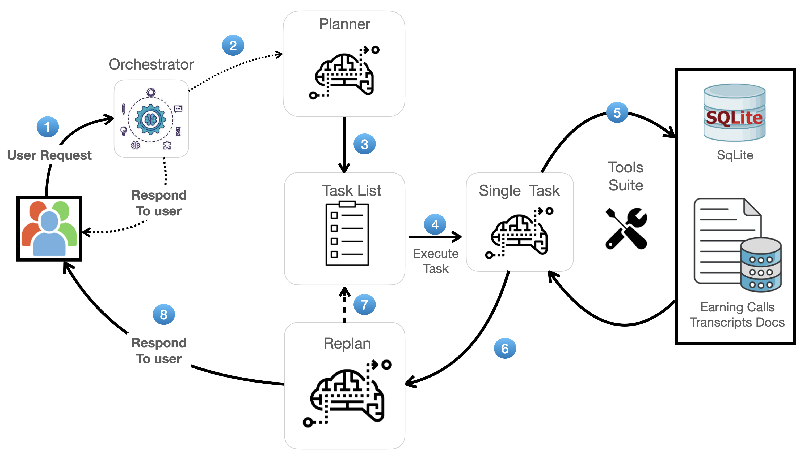

# QA on Earnings Calls Transcripts & Fundamental Analysis with LLM Agent

This repo demonstrates how to build a `plan-and-execute` style LLM agents to perform complex financial analysis using 
structured and unstructured data. The agent processes:

* `earnings call transcripts` and 
* `time-series financial fundamentals`

## Questions

The agent can answer complex financial questions such as:

* What are the key differences in the competitive market environments where Lyft and Uber operate?
* Compare the total revenue between uber and lyft in 2020. How do these revenues compare to Uber's average revenue from Q4 2012 to
  Q2 2016?

## LLM Agent Architecture

This is similar to a typical [ReAct](https://arxiv.org/abs/2210.03629) style agent where you think one step at a time. The advantages of this `plan-and-execute`
style agent are:

1. Explicit long term planning, which even strong LLMs can struggle with
2. Ability to use smaller models for the execution step, only using larger/better/expensive models for the planning step

The framework proposed here is organized as follows:

1. The user submits a request to the `Orchestrator`. The request can be a simple questions (e.g., 'What is the capital of Spain?') or a request that requires careful planning and execution to answer.
2. If the users determins that the request requires planning, it sents the request to the `Planner`.
3. The `Planner` breaks down the request into a list of actionable tasks
4. Each task is then executed using a list of available `Tools`, which allow our agent to commnicate with the outside world and retrieve the necessary information to complete the task. The outside world may include the web, a repository of documents, a large collection of images, or any other structured or unstructured source of information and data.
5. `Tools` here refer to various mechanisms and functions that enable our agent to access the nessecary information, such as APIs, Retrieval-Augmented Generation (RAG) systems and etc.
6. Once all the tasks are executed, the final output is sent to `Replan`, which evaluates whether the result meets the requirements of the original request.
7. If the answer is not satisfactory, `Replan` will refine the task list and generate a new execution plan. This process may iterate multiple times until an appropriate answer is obtained.
8. Once `Replan` determines that the final answer is sufficient, it is communicated back to the user.

## Financial Data

Fundamentals Used:

* **Market Cap**: The total value of its outstanding shares of stocks. 
  It provides a measure of a company's overall worth as perceived by the stock market. Market Cap is calculated as: Market Cap = Share Price x Number of outstanding shares, where outstanding share is the total number of shares currently held by shareholders, including institutional investors and company insiders.

* **Trailing P/E** (Price-to-Earnings Ratio) is a valuation metric that compares a company's current stock price to its earnings per share (EPS) over the past 12 months (trailing 12 months) Traling PE = current stock price / EPS over the last 12 months. It provides insights into how much investors are willing to pay each for each dollar of earnings the company generated in the past.

* **Forward P/E** is metric that measures a company's current stock price relative to its expected earnings per share (EPS) over the next 12 months or a specified future period. Unlike the trailing P/E, which uses historical earnings, the forward P/E is based on projected or forecasted earning. Forward P/E = Current Stock Price / Estimated Future Earnings Per Share (EPS). The estimated future EPS is the company's forecasted earnings per share, typically based on analyst estimates or company guidance. A high forward P/E may indicate that investors expect significant growth in future earnings. A lower Forward P/E might signal limited growth potential or undervaluation (or potentially higher risk)

* **PEG Ratio** (Price/Earnings-to-Growth Ratio) is a valuation metric that adjusts the traditional (P/E) by factoring in a company's earning growth rate. It provides a more concrete picture on whether a stock is overvalued or undervalued by considering how fast the company's earning are expected to grow. PEG Ratio = PE Ratio / Earnings Growth Rate (%), where Earnings Growth Rate (%) is the expected annual growth rate of the company's earning, expresses as a percentage. If PEG = 1: the stock is fairly valued relative to its growth. If PEG < 1, the stock is undervalued relative to its growth potential. PEG > 1 indicates that the stock is overvalued relative to its growth.

* **Price/Sales** (P/S) ratio is a financial evaluation metric that compares a company's market cap (or stock price) to its total revenue (sales). It shows how much investors are willing to pay for each dollar of a companies sales and is commonly used to evaluate companies, particular those in industries where earning maybe inconsistent or nonexistent (e.g., startups or tech companies). P/S Ratio = MArket Cap / Total Revenue, where Market Cap = Stock Price x Number of Shares Outstanding