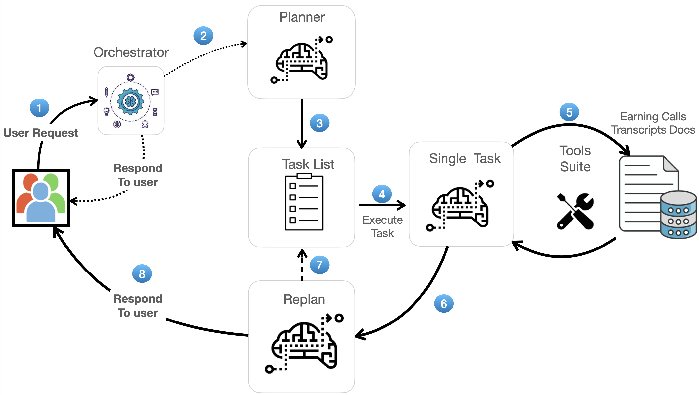

# QA on Earnings Calls Transcripts with LLM Agent

This notebook shows how to create a simple `plan-and-execute` style agent to perform multi-hop QA on earnings calls transcripts.

This is similar to a typical [ReAct](https://arxiv.org/abs/2210.03629) style agent where you think one step at a time. The advantages of this `plan-and-execute`
style agent are:

1. Explicit long term planning, which even strong LLMS can struggle with
2. Ability to use smaller models for the execution step, only using larger/better/expensive models for the planning step